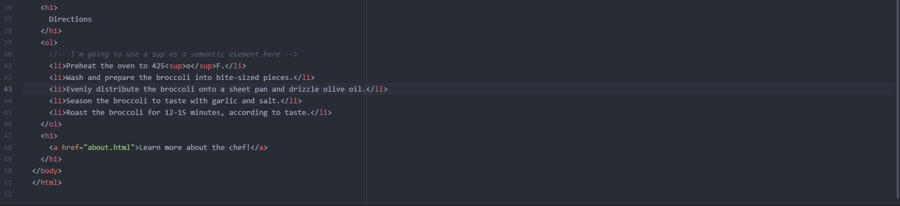

What is the difference between semantic and structural markup?
Structural markup is a means of organizing information in a document through structural elements such as headings, paragraphs, breaks, lists, etc.
Semantic markup is in reference to elements that emphasize and enhance the meaning of certain portions of a document such as using quotations, links, strike throughs, italics, etc.

