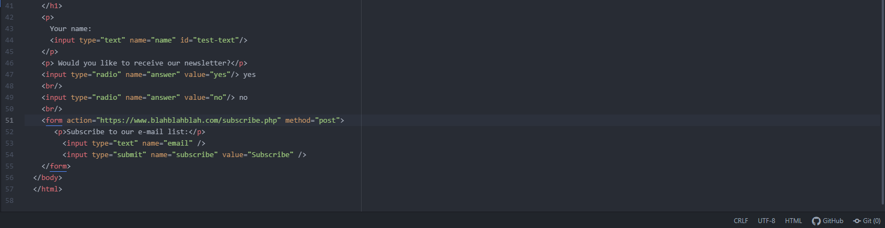

What forms have you come across on the internet?
Every day I find a variety of different forms, such as drop-down boxes, text entry and password inputs.
Drop-down boxes help the website determine responses from a user from a pre-determined bank of items.
Text-entry forms allow users to input information freely and (presumably) submit them
Password input forms are for the user to enter their password for a given page to gain access to specific account information for that user, which was saved through 1st party cookies stored, generated, and collected by that website.
Forms are a great way for websites to get information from a user and translate it into relevant action items/data for the user.

