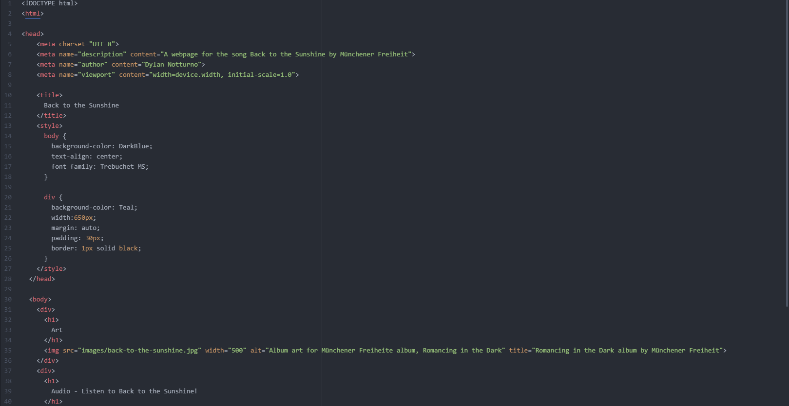
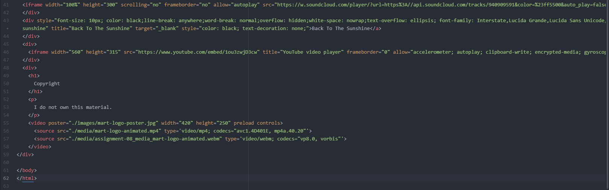

What is an affordance?
  An affordance is the set of possible actions for an object. They don't have to be communicated through visual information, they can be tactile, auditory, or combinations of many different things.
What are the advantages and disadvantages of using a third-party service like YouTube or Vimeo to host your videos?
  Advantages of YouTube include easy access to a large array of video content and an easy means of sharing and/or saving that content. Vimeo offers users the ability to easily upload and manage
  video content. The disadvantages of the two services: On YouTube there are copyright barriers that limit what content is readily available on the site. Vimeo is limited by the amount of storage
  per account and also has a much smaller audience compared to YouTube, so there might not be as much content available.
Optional: What challenges did you face this week with this assignment? How did you overcome them?
  The tutorial was extremely helpful in solving problems, especially when it came to embed links from SoundCloud and YouTube. The process taught me to be more thoughtful with what I pasted into
  my code to ensure that I closed any extra elements or changed information to work with my website.
  
  
