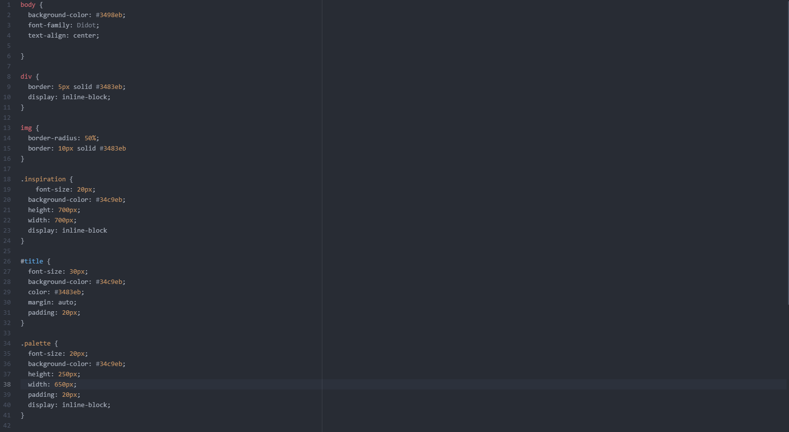
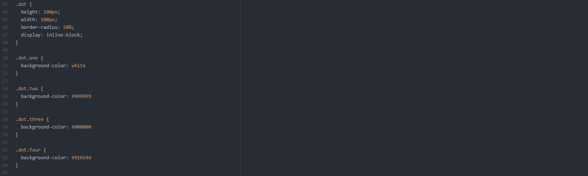
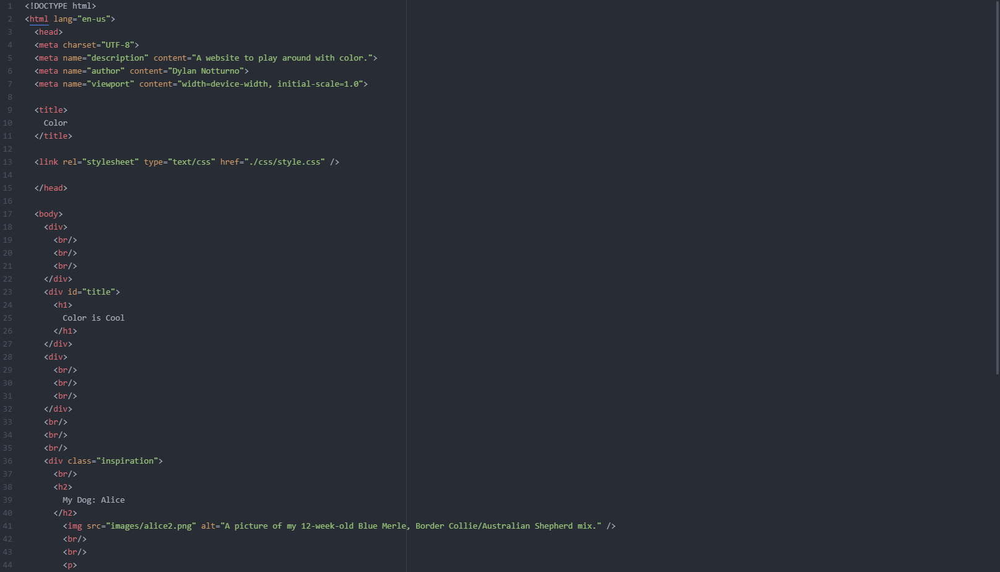
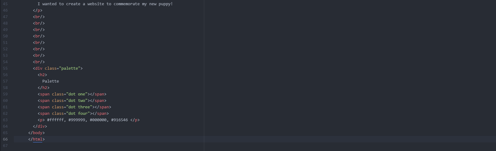

Describe the difference between the universal, element, class, and id selector types. When might you choose one over the other to style content?
The universal selector is indicated by an asterisk and it selects everything on the webpage (or that is inside the parent element)
The element selector is a way to select all of the elements with a given tag name on a webpage, and apply the same styles to each element.
The class selector starts with a "." and it will select everything on the webpage with that class applied to it.
The type selector selects an HTML tag or element on the webpage such as .

Discuss your color palette. How did you choose your colors?
I selected the colors of my puppy's coat. She's a Blue Merle Australian Shepherd/Border Collie mix!

Optional: discuss any challenges you faced this week, and how you overcame them.
CSS was very fun to explore and the tutorial was very helpful for generated some unique ideas. I had some trouble making sure everything lined up properly and ensuring that I was communicating
properly between my CSS style sheet and index.html file.

