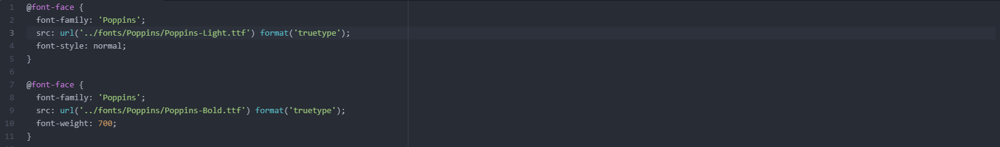
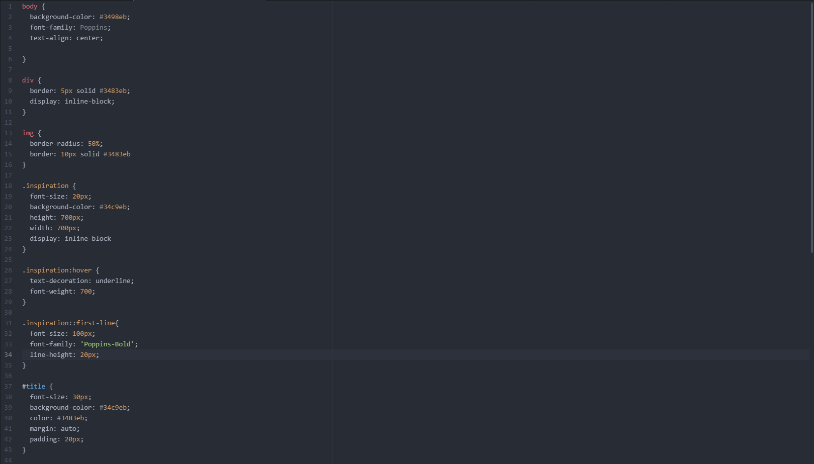
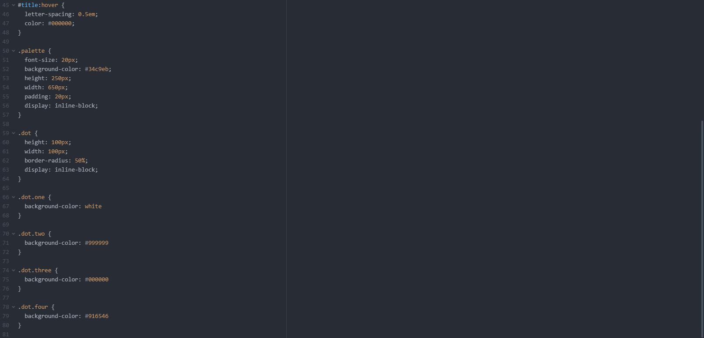
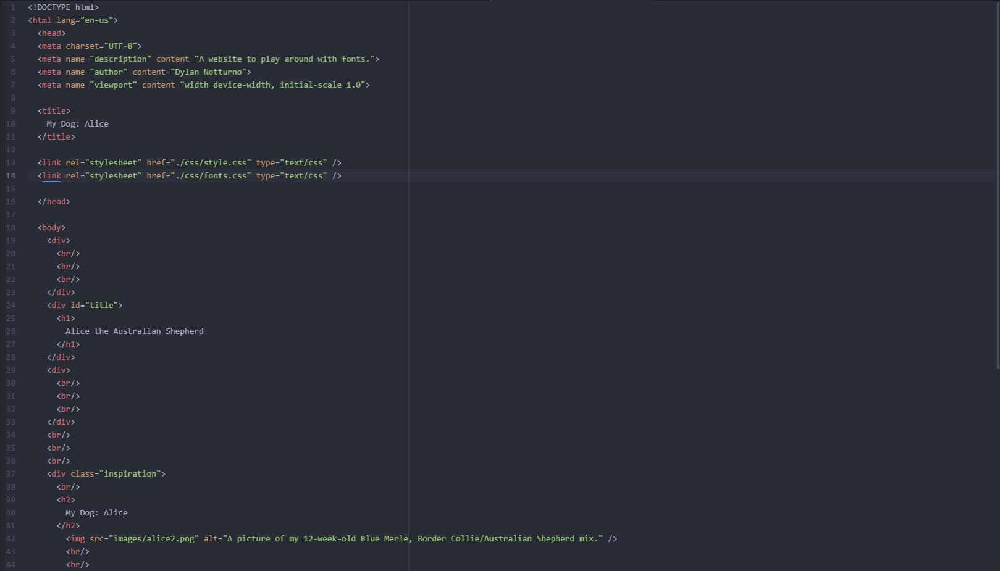
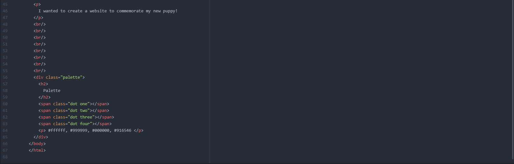

What is typography?
Typography is an art and/or technique of stylizing and arranging type. This arrangement includes typefaces, line-spacing, kerning, and more. Typography is the appearance and manipulation of text
in a document or other form and also includes the font size and style.

What is the importance of having fallback fonts or a font stack?
Fallback fonts are very important for web development as not all fonts are recognizable on every system. A fallback font is a reserve typeface that will display a character that is not available in
the other fonts. This ensures that a website is still legible and usable despite system differences.

What is the difference between a system font, web font, and web-safe font?
Web fonts are fonts that are not installed on every operating system and device.
Web-safe fonts differ from web fonts as they are a collection of well-known and heavily used fonts that are pre-installed on a wide range of computer systems and devices meaning they are "safe"
to use for web design.
System fonts are fonts that are already installed on your device and so when visiting a new webpage with those fonts it isn't necessary to install that font to read it in the intended font.

