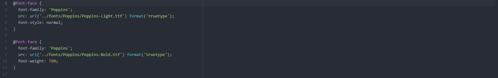

What is the difference between padding, margin, and borders?
Padding is the space between the content and the border, margin is the space outside between the outside of the border and the body its contained in, and borders are the actual borders of the element.

